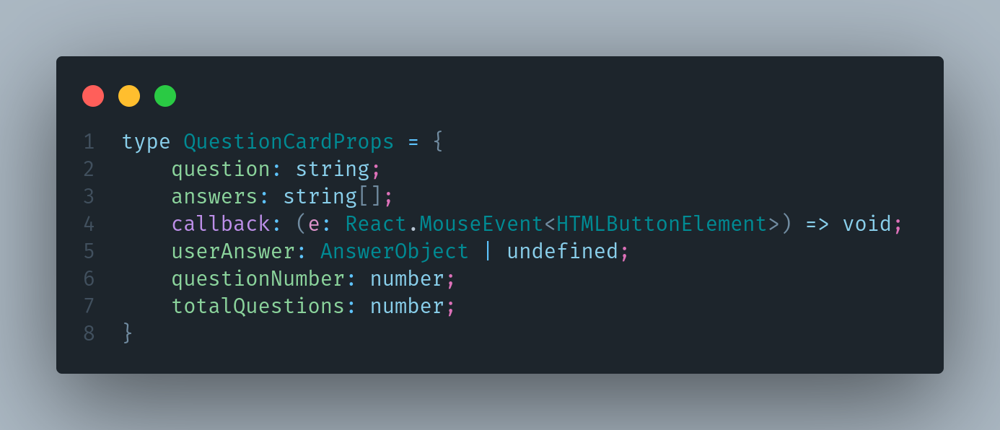
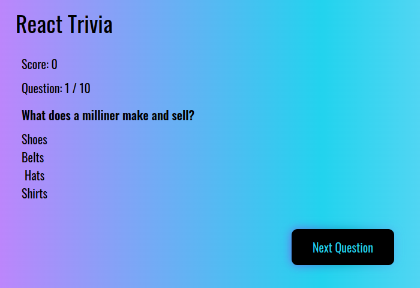

# ReactJS + Typescript + Tailwindcss Quiz App

This is a simple quiz app that uses [Open Trivia Database](https://opentdb.com/) in order to generate random trivia questions with appropriate answers.

This project has some bugs (even though tailwindcss makes css better, css still sucks), and was created solely to practice the ReactJS + Typescript + Tailwindcss frontend stack. It's usable but even I don't recommend it.

